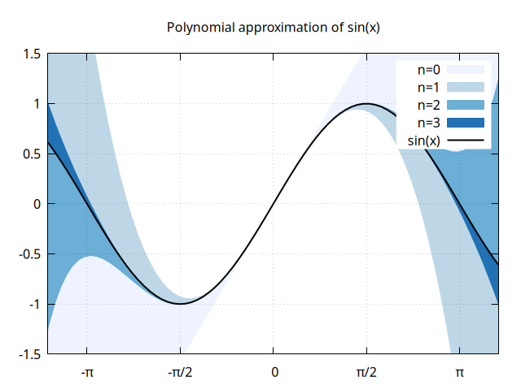
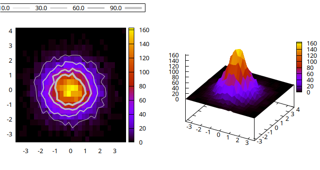

# Gnuplot.jl
## A Julia interface to gnuplot.

[](https://travis-ci.org/gcalderone/Gnuplot.jl)
[](LICENSE.md)
[](https://gcalderone.github.io/Gnuplot.jl/v1.3.0/)


**Gnuplot.jl** is a simple package able to send both data and commands from Julia to an underlying [gnuplot](http://gnuplot.sourceforge.net/) process.  Its main purpose it to provide a fast and powerful data visualization framework, using an extremely concise Julia syntax.


## Installation

Install with:
```julia
]add Gnuplot
```
A working [gnuplot](http://gnuplot.sourceforge.net/) package must be installed on your platform.

You may check the installed **Gnuplot.jl** version with:
```julia
]st Gnuplot
```
If the displayed version is not v1.3.0 you are probably having a dependency conflict. In this case try forcing installation of the latest version with:
```julia
]add Gnuplot@1.3.0
```
and check which package is causing the conflict.


Test package:
```julia
using Gnuplot
println(Gnuplot.gpversion())
test_terminal()
```


## Quick start
The following examples are supposed to be self-explaining.  See [documentation](https://gcalderone.github.io/Gnuplot.jl/v1.3.0/) for further informations.

### A simple parabola
```julia
x = 1.:20
@gp x x.^2 "with lines title 'Parabola'"
save(term="pngcairo size 480,360", output="examples/ex1.png")
save("parabola.gp")  # => save a script file with both data and command to re-create the plot.
```


### A slightly more complex plot, with unicode on X tics
```julia
x = -2pi:0.1:2pi
approx = fill(0., length(x));
@gp tit="Polynomial approximation of sin(x)" key="opaque" linetypes(:Blues_4)
@gp :- "set encoding utf8" raw"""set xtics ('-π' -pi, '-π/2' -pi/2, 0, 'π/2' pi/2, 'π' pi)"""
@gp :- xr=3.8.*[-1, 1] yr=[-1.5,1.5] "set grid front"
@gp :- x sin.(x) approx .+=  x          "w filledcurve t 'n=0' lt 1"
@gp :- x sin.(x) approx .+= -x.^3/6     "w filledcurve t 'n=1' lt 2"
@gp :- x sin.(x) approx .+=  x.^5/120   "w filledcurve t 'n=2' lt 3"
@gp :- x sin.(x) approx .+= -x.^7/5040  "w filledcurve t 'n=3' lt 4"
@gp :- x sin.(x)                        "w l t 'sin(x)' lw 2 lc rgb 'black'"
save(term="pngcairo size 640,480", output="examples/ex2.png")
```



### Multiplot: a 2D histogram contour plot and a 3D surface plot
```julia
x = randn(10_000)
y = randn(10_000)
h = hist(x, y, bs1=0.25, nbins2=20)
@gp "set multiplot layout 1,2"
@gp :- 1 key="outside top center box horizontal" "set size ratio -1" h
clines = contourlines(h, "levels discrete 10, 30, 60, 90");
for i in 1:length(clines)
    @gp :- clines[i].data "w l t '$(clines[i].z)' lw $i lc rgb 'gray'" :-
end
@gsp :- 2 h.bins1 h.bins2 h.counts "w pm3d notit"
save(term="pngcairo size 660,350 fontscale 0.8", output="examples/ex3.png")
```



## Further examples
The main gallery of examples is maintained in a separate repository:
https://lazarusa.github.io/gnuplot-examples/

Since **Gnuplot.jl** is just a transparent interface (not a wrapper) it exposes all capabilities of the underlying gnuplot process, hence pure-gnuplot examples also applies to **Gnuplot.jl**.  Further examples are available here:
- http://gnuplot.sourceforge.net/demo_5.2/
- http://www.gnuplotting.org/
