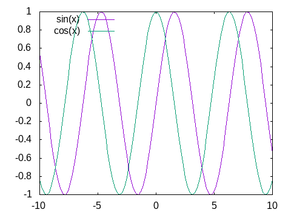
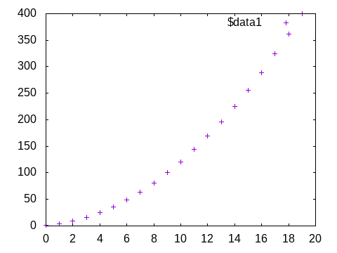
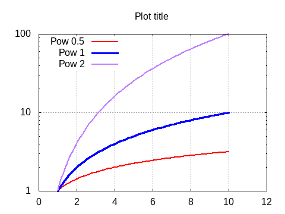
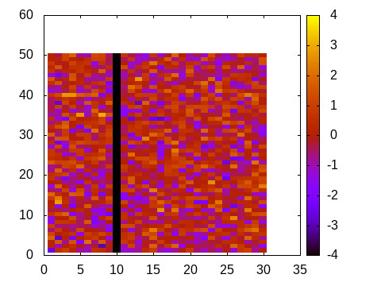

# Basic usage

The main purpose of the **Gnuplot.jl** package is to send data and commands to the underlying `gnuplot` process, in order to generate plots.  Unlike other packages, however, the actual commands to plot, or the plot attributes, are not specified through function calls.  This is what makes **Gnuplot.jl** *easy to learn and use*: there are no functions or keywords names to memorize[^1].

The most important symbols exported by the package are the `@gp` (for 2D plots) and `@gsp` (for 3D plots) macros, both accepting any number of arguments, and whose meaning is interpreted as follows:

- one, or a group of consecutive, array(s) build up a dataset.  The different arrays are accessible as columns 1, 2, etc. from the `gnuplot` process.  The number of required input arrays depends on the chosen plot style (see `gnuplot` documentation);

- a string occurring before a dataset is interpreted as a `gnuplot` command (e.g. `set grid`);

- a string occurring immediately after a dataset is interpreted as a *plot element* for the dataset, by which you can specify `using` clause, `with` clause, line styles, etc.;

- the special symbol `:-`, whose meaning is to avoid creating a new plot (if given as first argument), or to avoid immediately running all commands to create the final plot (if given as last argument).  Its purpose is to allow splitting one long statement into multiple (shorter) ones.

The above lists all the required concepts to follow the examples presented below.  The `@gp` and `@gsp` macros also accepts further arguments, but their use will be discussed in [Advanced techniques](@ref).

[^1]: a previous knowledge of [`gnuplot`](http://gnuplot.sourceforge.net/documentation.html) usage is, nevertheless, required.

## [2D plots](@id plots2d)

Here we will show a few examples to generate 2D plots.  The examples are intentionally very simple to highlight the behavior of **Gnuplot.jl**.  See [Examples](@ref) for more complex ones.

Remember to run:
```julia
using Gnuplot
```
before running the examples.

```@setup abc
using Gnuplot
Gnuplot.quitall()
Gnuplot.splash("assets/logo.png")
saveas(file) = save(term="pngcairo size 480,360", output="assets/$file")
push!(Gnuplot.options.init, "set term unknown")
```


### Simple examples involving just `gnuplot` commands:

---
#### Plot a sinusoid:
```@example abc
@gp "plot sin(x)"
saveas("basic1.png") # hide
```


---
#### Plot two curves:
```@example abc
@gp "set key left" "plot sin(x)" "pl cos(x)"
saveas("basic2.png") # hide
```


!!! note
    Note that all `gnuplot` commands can be abbreviated as long as the resulting string is not ambiguous.  In the example above we used `pl` in place of `plot`.

---
#### Split a `@gp` call in three statements:
```@example abc
@gp    "set grid"  :-
@gp :- "p sin(x)"  :-
@gp :- "plo cos(x)"
saveas("basic3.png") # hide
```


### Send data from Julia to `gnuplot`:

#### Plot a parabola
```@example abc
@gp (1:20).^2
saveas("basic4.png") # hide
```



---
#### Plot a parabola with scaled x axis, lines and legend
```@example abc
x = 1:20
@gp "set key left"   x ./ 20   x.^2   "with lines tit 'Parabola'"
saveas("basic5.png") # hide
```


---
#### Multiple datasets, logarithmic axis, labels and colors, etc.
```@example abc
x = 1:0.1:10
@gp    "set grid" "set key left" "set logscale y"
@gp :- "set title 'Plot title'" "set label 'X label'" "set xrange [0:12]"
@gp :- x x.^0.5 "w l tit 'Pow 0.5' dt 2 lw 2 lc rgb 'red'"
@gp :- x x      "w l tit 'Pow 1'   dt 1 lw 3 lc rgb 'blue'"
@gp :- x x.^2   "w l tit 'Pow 2'   dt 3 lw 2 lc rgb 'purple'"
saveas("basic6.png") # hide
```


!!! note
    The above example lacks the trailing `:-` symbol.  This means the plot will be updated at each command, adding one curve at a time.

---
## Keywords for common commands
In order to avoid typing long, and very frequently used `gnuplot` commands, **Gnuplot.jl** provides a few keywords which can be used in both `@gp` and `@sgp` calls:
 - `xrange=[low, high]` => `"set xrange [low:high]`;
 - `yrange=[low, high]` => `"set yrange [low:high]`;
 - `zrange=[low, high]` => `"set zrange [low:high]`;
 - `cbrange=[low, high]`=> `"set cbrange[low:high]`;
 - `key="..."`  => `"set key ..."`;
 - `title="..."`  => `"set title \"...\""`;
 - `xlabel="..."` => `"set xlabel \"...\""`;
 - `ylabel="..."` => `"set ylabel \"...\""`;
 - `zlabel="..."` => `"set zlabel \"...\""`;
 - `xlog=true`   => `set logscale x`;
 - `ylog=true`   => `set logscale y`;
 - `zlog=true`   => `set logscale z`;

All such keywords can be abbreviated to unambiguous names.

By using the above keywords the first lines of the previous example:
```julia
@gp    "set grid" "set key left" "set logscale y"
@gp :- "set title 'Plot title'" "set label 'X label'" "set xrange [0:12]"
```
can be replaced with a shorter version:
```julia
@gp    "set grid" k="left" ylog=true
@gp :- tit="Plot title" xlab="X label" xr=[0,12]
```

## Plot images

**Gnuplot.jl** can also display images, i.e. 2D arrays:
```@example abc
img = randn(Float64, 30, 50)
img[10,:] .= -4
@gp img "w image notit"
saveas("basic7a.png") # hide
```


Note that the first index corresponds to the `X` coordinate when the image is displayed.

The following example shows how to fix orientation of an image by means of the `using` clause (the `TestImages` package is required to run this example):
```@example abc
using TestImages
img = testimage("lena");
@gp "set size square" "set autoscale fix" img "u 2:(-\$1):3:4:5 with rgbimage notit"
save(term="jpeg size 480,360", output="assets/basic7b.jpg") # hide
```


## [3D plots](@id plots3d)
3D plots follow the same rules as 2D ones, just replace the `@gp` macro with `@gsp` and add the required columns (according to the plotting style).

E.g., to plot a spiral increasing in size along the `X` direction:
```@example abc
x = 0:0.1:10pi
@gsp x  sin.(x) .* x  cos.(x) .* x  x./20  "w p pt 7 ps var lc pal"
saveas("basic8.png") # hide
```


The keywords discussed above can also be used in 3D plots.

## Palettes and line styles
The **Gnuplot.jl** package comes with all the [ColorSchemes](https://juliagraphics.github.io/ColorSchemes.jl/stable/basics/#Pre-defined-schemes-1) palettes readily available.

A `gnuplot`-compliant palette can be retrieved with `palette()`, and used as any other command.  The previous example may use an alternative palette with:
```@example abc
x = 0:0.1:10pi
@gsp palette(:viridis) x  sin.(x) .* x  cos.(x) .* x  x./20  "w p pt 7 ps var lc pal"
saveas("basic8a.png") # hide
```


The [ColorSchemes](https://juliagraphics.github.io/ColorSchemes.jl/stable/basics/#Pre-defined-schemes-1) palettes can also be used to generate line styles, by means of the `linestyles()` function, e.g.
```@example abc
@gp linestyles(:deepsea)
x = 1:0.1:4pi
for i in 1:5
    @gp :- x i.* sin.(x) "w l notit ls $i lw 5"
end
saveas("basic9.png") # hide
```


## Exporting plots to files

The `save()` function allows to export all plots (as well as multiplots, see [Multiplot](@ref)) to a file using one of the many available `gnuplot` terminals.  To check which terminals are available in your platform type `set term` in your `gnuplot` terminal.

All plots in this page have been saved with:
```julia
save(term="pngcairo size 480,360", output="assets/output.png")
```
except the *Lena* image, saved with the `jpeg` terminal:
```julia
save(term="jpeg size 480,360", output="assets/output.png")
```

## Gnuplot scripts
Besides exporting plots in a file **Gnuplot.jl** can also save a *script*, i.e. a file containing the minimum set of data and commands required to generate a plot within `gnuplot`.

To generate a script for one of the example above use:
```julia
save("script.gp")
```
after the plot has been displayed.  The script can then be used within a `gnuplot` session as follows:
```
gunplot> load 'script.gp'
```
to generate a plot identical to the original one, without using the Julia language.

The purpose of `gnuplot` scripts is to allow sharing all data, alongside a plot, in order to foster collaboration among scientists and replicability of results.  Moreover, a script can be used at any time to change the details of a plot, without the need to re-run the Julia code used to generate it the first time.

Finally, the scripts are the only possible output when [Dry sessions](@ref) are used (i.e. when `gnuplot` is not available in the user platform.
