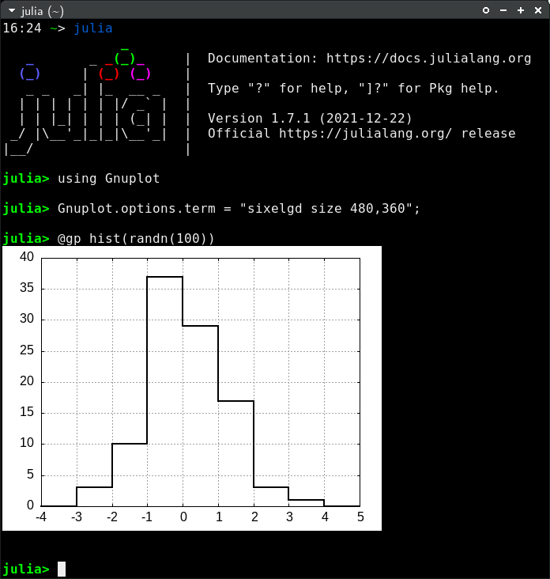

# Gnuplot terminals

Gnuplot provides dozens of terminals to display plots or export them into files (see [`terminals()`](@ref) to get a list of enabled terminals on your platform).  This section discuss a few tips on how to use the most common terminals.

To use a specific terminal for interactive use you may either set it as initialization command for all new session with (see [Options](@ref)):
```julia
Gnuplot.options.term = "wxt")
```
or directly send the command to a specific session (see [Direct command execution](@ref))
```julia
gpexec("set term wxt")
```
See official [gnuplot documentation](http://gnuplot.sourceforge.net/documentation.html) for further info on terminals and their options.


## Interactive terminals (`wxt` and `qt`)
The multiplatform `wxt` and `qt` terminals are among the most widely used ones for their nicely looking outputs on display and for their interactive capabilities.

You may set them as terminal with:
```
"set term wxt size 800,600"
```
or
```
"set term qt  size 800,600"
```
(the `size 800,600` is optional and can be omitted).

Press the `h` key on the window to display an help message with all available keyboard shortcuts.  In particular press `6` to enable printing plot coordinates on Julia stdout (ensure mouse is enabled with `m`).


## Plot in a terminal application (`dumb`, `sixel` and `sixelgd`)
Gnuplot supports plotting in a terminal application, with no need for X11 or other GUI support, via the `dumb`, `sixel` and `sixelgd` terminals.  These are extremely useful when you run Julia on a remote shell through `ssh`, with no X11 forwarding.

The `dumb` terminal uses ASCII characters to draw a plot, while `sixel` and `sixelgd` actually use bitmaps (but require Sixel support to be enabled in the terminal, e.g. `xterm -ti vt340`).  A sixel plot on `xterm` looks as follows:


The above terminals are available if gnuplot has been compiled with the `--with-bitmap-terminals` option enabled and Libgd (only for `sixelgd`).


## Export to image files

Gnuplot provides dozens of terminals able to export on files.  Examples are:
- `cairopng` to export PNG files;
- `pdfcairo` for PDF;
- `jpeg` for JPG;
- `gif` for GIF (see [Animations](@ref)).

All the above terminals support the `size` and `fontscale` options to quickly adjust the size of the rasterized image and the size of the font respectively.  E.g.:
```julia
save(term="pngcairo size 480,360 fontscale 0.8", output="output.png")
```
(see also [`save()`](@ref)).

Gnuplot is also able to export vector (i.e. non-raster) plots through the `svg` terminal.

## The `cairolatex` terminal
The `cairolatex` terminal allows to produce high quality plots by splitting the output into a PDF file (containing a rasterized image of a plot) and a `.tex` file (containing all the text as ``\LaTeX`` code).  The following example shows how to write plot tics and an equation in ``\LaTeX``:
```julia
x = LinRange(-2pi, 2pi, 1000)
@gp t="Polynomial approximation of sin(x)"  "set style fill transparent solid 0.6 noborder"
@gp :- raw"""set xtics ('$-\pi$' -pi, '$-\pi/2$' -pi/2, 0, '$\pi/2$' pi/2, '$\pi$' pi)"""
@gp :- xr=3.8.*[-1, 1] yr=[-1.5,1.5] key="box opaque left horiz" linetypes(:Blues_3) "set grid front"
latex = raw"""\begin{minipage}[c]{\textwidth}\begin{equation*}""" *
	raw"""\sin(x) = \sum_0^{+\infty} \frac{(-1)^n}{(2n + 1)!} x^{2n+1}""" * 
	raw"""\end{equation*} \end{minipage}"""
@gp :- "set label at graph 0.62,0.2 front center '$latex'"
approx = fill(0., length(x));
@gp :- x sin.(x) approx .+=  x          "w filledcurve t 'n=0' lt 1"
@gp :- x sin.(x) approx .+= -x.^3/6     "w filledcurve t 'n=1' lt 2"
@gp :- x sin.(x) approx .+=  x.^5/120   "w filledcurve t 'n=2' lt 3"
@gp :- x sin.(x) approx .+= -x.^7/5040  "w filledcurve t 'n=3' lt 4"
@gp :- x sin.(x)                        "w l t 'sin(x)' lw 2 lc rgb 'black'"
save(term="cairolatex pdf input color dashed size 5in,3.3in", output="test.tex")
```
!!! warning
    If you add a path in the `output=` keyword this will also be copied in the the `.tex` file.  I suggest to use just filenames, with no path, in order to avoid possible errors when compiling ``\LaTeX`` code.

The two output files (`test.tex` and `test.pdf`) can then be included in a ``\LaTeX`` file as follows:
```latex
\documentclass{article}
\usepackage{amsmath}
\usepackage{graphicx}
\usepackage{color}

\begin{document}
\begin{figure}
  \input{test.tex}
\end{figure}
\end{document}
```
And the output is:

